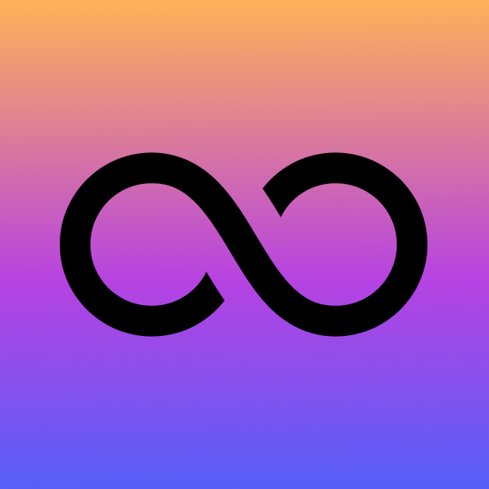

# Universal Dollar

## stablecoin

- full name: `Universal Dollar`
- symbol: `U8D`
- decimals: `18`
- icon:



## contracts
### mainnet
- `0x2137fFbbB279218E1a61d4483DeD9C9a017e9257` **DAO (U8DS)**
- `0x888888877A18532b78d259577d00057054C50Dd8` **U8D**
- `0x8cb7c5422672F5432363C628358A5e7eA6938DC2` **Oracle**
- `0x78c54b20CC4C2db6E7A9758aE16579D866BA6FFD` **UniswapV2 USDC:U8D Pair**
- `0x111eB123d0CEeEa59A3736ae1767F9E756bE8160` **LP Incentivation Pool**

## audit

audit of ESD is available [here](audit/REP-Dollar-06-11-20.pdf).
<br>our audit will be available till the end of January 2021

## u8d links

- [Website](https://u8d.finance)
- [Github](https://github.com/8quad)
- [Medium](https://8quad.medium.com/)
- [Twitter](https://twitter.com/u_8_d)
- [Telegram](https://t.me/UniversalDollar)
- [Discord](https://discord.gg/3uTPBqkyvc)

## disclaimer
this project is an experiment - the protocol is audited, and we've put a significant amount of work into testing as well as generally de-risking the design of its core mechanism, however participants should take great caution as bugs resulting in loss of funds are always a possibility.

```
Copyright 2021 Universal Dollar Devs, based on the works of the Empty Set Squad

Licensed under the Apache License, Version 2.0 (the "License");
you may not use the included code except in compliance with the License.
You may obtain a copy of the License at

http://www.apache.org/licenses/LICENSE-2.0

Unless required by applicable law or agreed to in writing, software
distributed under the License is distributed on an "AS IS" BASIS,
WITHOUT WARRANTIES OR CONDITIONS OF ANY KIND, either express or implied.
See the License for the specific language governing permissions and
limitations under the License.
```

<br>
made with passion by the 8quad.
